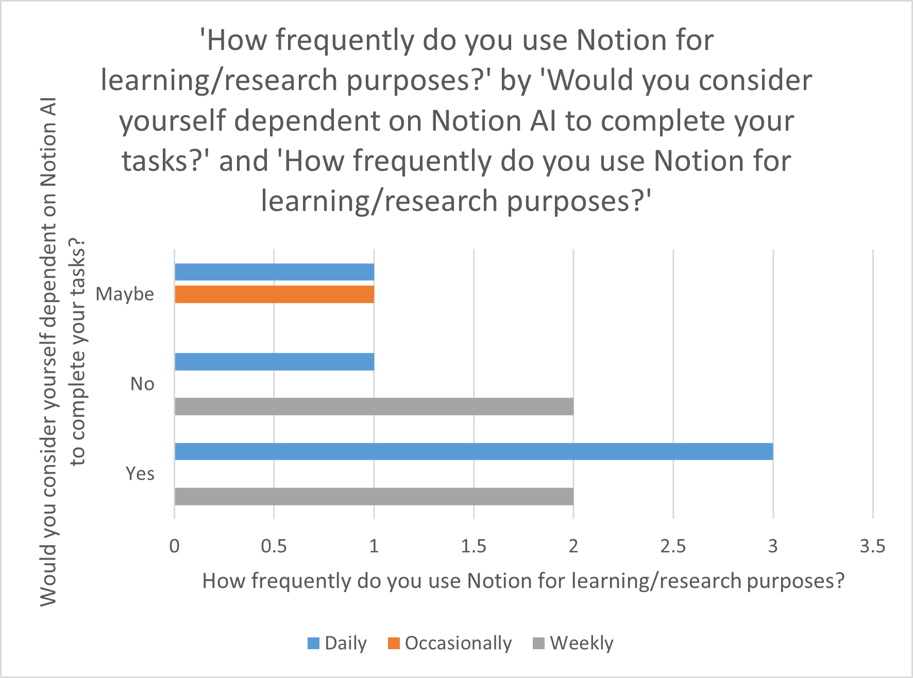

# Task 1

## 1.1. 
**Explain what kind of system you select in this assignment and the reasons for your selection. [5]**

After deliberating on a couple of potential ML enabled products, we picked notion for this assignment specifically their offering combining AI capabilities with the traditional note taking software in the form of notion AI. To provide a bit more context, notion possesses advanced capabilities in comparison to a traditional note taking app such as google keep or onenote. It combines into a single system the processes for taking notes on projects, knowledge management and collaboration. For a user who is a student or researcher, these capabilities can prove to be extremely useful.

We picked notion AI because we wanted to explore how AI may help to enhance user experience when the traditional deterministic notion app has been able to satisfy most of their users. It is a good opportunity to depict clearly how AI may be able to carve a niche for itself even in scenarios where usecases have been defined and satisfied unambiguously by existing apps.

A student or a full-time researcher (working within academia) would expect flexibility and customisation in their workspace for taking notes. They would want integrations with third parties and the ability to export their notes in an unrestricted manner. There should be support for figures, looks and media to be embedded with the notes. Further, it should be free or sufficiently cheap such that cost is not a barrier for these categories of users. Notion AI takes things a step further by providing:

* Intelligent search based on user intent and considers the context of the information provided to give output from existing notes and external data.
* It can suggest workflows to users providing task automation and save them time and effort.
* It provides insights on the existing notes the user has stored and offers a personalized experience to the users. Teams can facilitate collaboration by taking up the role of managing logistics for the team’s workspace.

## 1.2.

**Discuss what kind of problem the intelligent system is trying to solve. What makes this problem hard? What are the particular strengths of having an intelligent system rather than a traditional system with deterministic behavior? What are the weaknesses of an intelligent system in this context compared to a traditional system? [15]**

**Intended users:** We are considering the primary users as students actively involved in studying or learning. Further, researchers requiring a tool to support their day-to-day activities are also part of the primary user group considered. We expect that all the users will be accessing the app through commonly available devices (mobile/ pc) and they would want cross platform compatibility. We do not expect the users to spend a lot of time in setting up the app for their use nor do we expect them to be willing to invest large sums of money to streamline their note taking and knowledge sharing workflow. However, these users owing to the nature of their work - study and research then sharing their knowledge - will be quite demanding in terms of the features they would expect from the app. Lastly, if the app is intended to support their learning activities so if using the app proves too complicated or slow such that it hinders their studying then it will not be adopted by the user, no matter how superior the features being offered by the app are.

#### What kind of problem the intelligent system is trying to solve?

**Information overload:** Usually, the users will create notes for a host of topics across a variety of subjects. This process will go on usually for a whole term or a school year. In the case of research projects, it can be even longer. The students/ researchers do not have much time to organize, sort and categorize this exponentially growing amount of data. What ends up happening is at the end, there is a big notebook with disjointed notes spread here and there. The user may not always end up with the same organizing scheme for their notes with which they initially started. Notion AI can solve this problem by interpreting and organizing the large datasets created by the user. It offers information retrieval and intelligent search capabilities based on the user’s intent.

**Automation:** To support users and free up their time, notion AI can automate repetitive tasks which users perform while taking notes or managing their projects. This involves suggesting workflows to the users automating a sequence of actions based on the past usage patterns. For instance, it can create reminders for the team’s workspace, rephrase the meeting notes, make them longer or shorter and automatically check off items off the checklist when they get completed. This sort of logistical support can be quite beneficial to keep things in order for a student/ researcher who may not be willing to spend quite a bit of time on these things and lead to a boost in productivity.

**Collaboration:** Frequently, multiple students have to work together on a project or an assignment. Notion provides the capabilities to allow different team members to work together seamlessly. Notion AI goes further ahead and provides capabilities to brainstorm new ideas as a team, plan projects and highlight action items and key takeaways from the meetings. 

**Personalized for each user:** Elaborating on the above mentioned point, notion AI does all this while ensuring that needs of all its diverse users are met at a personalized level. It learns the usage pattern for each user and delivers a unique experience to each user based on what suits them best. Notion AI adds generatie AI capabilities while delivering a personalized user experience.

#### What makes this problem hard?

**Exponential growth of data:** The amount of data which the app has to deal with is tremendous. For instance, there will be notes created by the user. There will be usage data based on the tracked user behavior in the app. There will be data from external sources to create a LLM. On top of that, there needs to be a feedback loop in this system. There needs to be control on the type of data being ingested for ML training and the outputs being produced. The app should not carry forward bias from its training data. The data created by users (notes) needs to be encrypted. Now, further complexity will arise because all this data is being created very quickly.

**Distributed system challenges:** A major selling point of the app is the focus on ensuring high productivity and collaboration among members across different platforms. There is little scope for lags and downtime. Model deployment and training should happen without affecting existing infrastructure. User data needs to be kept safe and in sync across all devices at all times. This would require solving some complicated distributed system engineering challenges to handle the huge number of devices.

**Handling privacy concerns:** 

* The data created by users (notes) needs to be kept safe(encrypted) at all times on all devices regardless of which AI enabled feature is being added to the app. There should be a clear separation of concerns and no unnecessary decryption of the notes. The user data should not be moved to different servers unless it is absolutely essential.
* It is plausible that a lot of users may not want their personal notes to be used for training models. There can be different laws governing the use of data for model training in different geographies (GDPR in Europe), so the app should have an opt -out feature available for users in cases where they don’t want their data to be ingested by the models. Further, there should be a way to accommodate their requests should they change their minds in the future and choose not to include their data in the ML model. In that case, retraining the model without their data may prove to be too costly. 

**Personalized experiences with generative AI:**

Building on top of the previous point, when the app can indeed learn from the user’s notes data, offering them a personalized enough experience through notion AI will be challenging. This is because it may be easy to offer everyone similar experience which is personal superficially but to truly cater to their individual needs and anticipating it based on their usage patterns and notes without simply mirroring the trends learned from the aggregated data will be challenging. It is possible that an extremely good implementation of such a system may prove to be too eerie for some users (they may interpret it as quite unnatural as if someone is peering over their shoulders while they are working). Then, the next challenge will be to define how personal is too personal.

#### What are the particular strengths of having an intelligent system rather than a traditional system with deterministic behavior?

**Adaptable:** It will be extremely flexible for users unlike a traditional deterministic system. They will be able to extract themes from existing data, summarize texts, generate new ideas and improve their writing by rephrasing entire work. Students and researchers may find it quite useful to overcome writer’s block whale drafting reports. Since notion has a strong support for embedding external content along with the notes, notion AI will add the capability to manipulate the embedded content as well within the scope of the app.

**Handle ambiguity:** Sometimes, there are cases when the user is not sure about how best to convey what they want to do in the app. They might be going through iterations of building up the idea and may not directly arrive at the steps to be fed to a deterministic system. Notion AI will help users in working with them through these iterations. It offers a chat-like interface (similar to chatGPT) so that user can work together with the AI assistant to create their content.

**Enhanced user experience:**

Because the user need not mention all the steps explicitly nor do they need to write complete content, this reduces the effort required from the user to a large extent. No longer is the onus of creating the content solely on the user, but the notion AI will support the user through this process. This makes things easier for the user and the added features lead to an enhanced user experience.

**Efficiency and productivity:** With the help of the generative capabilities of the assistant, the user can offload some parts of the tasks for creating content and the admin tasks for managing notes entirely on the notion AI assistant. This will lead to greater productivity for the users as they can get more done in the same amount of time.

#### What are the weaknesses of an intelligent system in this context compared to a traditional system?

**Data training and aggregation:** As opposed to a traditional system, notion AI will require huge amounts of data for training. The aggregation of data was not required previously for deterministic systems. They were much more concerned about handling large amounts of data but that would come in the later stages of the product’s lifecycle. For intelligent systems, before they can be offered to the users, there needs to be a sizable chunk of training data so that the features being offered work as intended and do not end up giving gibberish as output. 

**Privacy concerns:** When the developers aggregate such huge amounts of data, there is bound to be privacy concerns because all of that data cannot be obtained in-house. They would have to go to external sources to retrieve the data but that part becomes increasingly murky in terms of how that data is collected at source. Further, the intelligent systems are effectively much more intrusive of the user’s privacy because in a way they have greater awareness of the user’s patterns. If the trained model is somehow hacked, then effectively the company has handed over patterns and nuances of a large number of users distilled and stored in a condensed manner, to the nefarious entities. 

**Infrastructure:** Creating the infrastructure to deploy, test and iteratively develop an intelligent system is much more complex than a traditional note taking app because on top of the features which are available in the deterministic app, the developers have to integrate generative AI features as well. To the user, it may appear as a single feature but behind the scenes, it will spawn a whole new section of the app owing to the data collection, training and deployment challenges associated with ML workloads. 

**Bias:** The models trained are only as good as the data provided to them. Since, the data will be ingested from a variety of sources, it will be the responsibility of the developers to ensure that the notion AI features does not end up generating content which is insensitive and harmful to its users and public at large as that can open the company to a lot of legal exposure.

**Interpretability:** To ensure accountability of its intelligent capabilities, having a system which can explain how and why certain decisions were made by the AI assistant can be very useful. If such a record can be maintained for each user along with the logs of the app, then it can be useful to troubleshoot issues in the intelligent system and not make it seem a black box like it is as of now. But implementing such a system is quite challenging and research is ongoing.

### References:

1. [Working as team with notion AI](https://www.notion.so/help/guides/how-product-teams-boost-productivity-and-spark-new-ideas-with-notion-ai)
2. [Notion-for-education](https://www.notion.so/product/notion-for-education)
3. User comment from reddit: [notion_ai_works_so_great](https://www.reddit.com/r/Notion/comments/10r8qwu/notion_ai_works_so_great/)
4. [whats_the_point_of_paying_10_monthly_for_notion](https://www.reddit.com/r/Notion/comments/11auryk/whats_the_point_of_paying_10_monthly_for_notion/)
5. User comment from reddit: [link](https://www.reddit.com/r/Notion/comments/12etz1i/not_sure_what_the_fuss_is_about_with_notion_ai/)
6. [ive_changed_my_mind_about_notion_ai](https://www.reddit.com/r/Notion/comments/12g6j3i/ive_changed_my_mind_about_notion_ai/)
7. [notion_ai_is_phenomenal](https://www.reddit.com/r/Notion/comments/12dfzu0/notion_ai_is_phenomenal/)
8. [notion-for-academic-research-management](https://andymcdonaldgeo.medium.com/notion-for-academic-research-management-9cb81a333d75)
9. [academic-research-notion](https://girlknowstech.com/academic-research-notion/)
10. Guide: [using-notion-ai](https://www.notion.so/help/guides/using-notion-ai)

# Task 2

## 2.1. User Classes & Stakeholders
**Explain the different user classes of your target system [10] and other stakeholders of the system [5].**

### User classes:
The different user classes of Notion, and how these different user classes use Notion:
- **Students**
	- Take lecture notes
	- Collaborate with other students on group projects
	- Keep track of their assignments and their progress in each classes
- **Team**
	- Collaborate on documents between team members
	- Take notes during meetings
	- Keep track of the project
	- Manage tasks of the team
- **Teachers or Professors**
	- Take notes for their classes, organize their course material
	- Keep track of their classes and progress of each student
	- Share resources with students
- **Company**
	- Quicky create shareable links from documents, for example to share a presentation of a project
	- Create documentation (for example, a hardware usage tutorial)
	- Manage projects by sharing notes, tasks, progress and documents amongst team members and with different teams.
- **Researchers**
	- Gather data
	- Organize research notes
	- Collaborate on research projects
- **Freelancers**
	- Keeping track of the progress of their projects
	- Manage their client projects
	- Maintain a portfolio
- **Artists, writer or content creator**
	- Noting new ideas and writing some drafts
	- The ease of use also helps them in not spending much time on the software so they can rather spend time on creative ideas and inspiration
	- Organize their projects

### Other stakeholders:
The other stakeholders of Notion, and why they may have an interest in Notion:
- **Notion's partners**
	- Integrate Notion in their product
	- Provide a service to Notion
- **Notion's Investors or Owner**
	- Financial interest in Notion
- **Notion's Employee (Developers, designers, marketers, etc.)**
	- Develop and market Notion
- **Stakeholders of product/business made by a Notion's user**
	- Documentation of the product made with Notion (for example a PDF generated with Notion)
	- Website or portfolio made with Notion

## 2.2. User research
**Perform user research (e.g. interviews and observation studies with real users) to gather information about the target user classes. Describe and provide evidence of your user research process, including the format and artifacts used and its outcome [10]. Make sure to obtain consent from the users about being part of the study and sharing their data with your teammates and graders. Avoid collecting personal identifiable information.**

### 2.2.1. User Survey

We created a survey to get an idea about the target user classes. The survey helped to understand how notion AI is helpful to the users and what are their pain points which the intelligent system can alleviate. Further, it also shed some light on the concerns which users may have notion AI. The survey could only be filled if the user consented to having the information recorded for the purposes of this assignment and there was a special provision to accommodate the feedback for use cases for teams.

#### Participants

The participants were friends of the group members and acquaintances of the friends of the group members. We had created the survey link and disseminated it in our social circles. Since the survey does not collect any personally identifiable information, we cannot attribute any response to the identity of the individual who filled the survey; however, we can analyze the trends observed across users.

**The survey was designed such that,**

* Only those people who consented to the data usage policy (which we declared before the start of the survey) could fill the survey.
* Only those users who have a habit of using notion for academic/ research based tasks could fill the survey.
* The survey responses accommodated different user classes in the target domain based on what they use notion AI for and the frequency with which they used it.

**Participant details:**

<table>
  <tr>
   <td>Type
   </td>
   <td>Percentage of users
   </td>
   <td>Notes
   </td>
  </tr>
  <tr>
   <td>Consent to information being collected by survey
   </td>
   <td>100%
   </td>
   <td>
   </td>
  </tr>
  <tr>
   <td>Level of education of the user
   </td>
   <td>Roughly 20% of total users represented by each category.
   </td>
   <td>Almost equally distributed between:
<ul>

<li>Undergraduate student

<li>Graduate student in professional (or) thesis programs

<li>Research intern

<li>Post-doc/ professor
</li>
</ul>
   </td>
  </tr>
  <tr>
   <td>Frequency of usage
   </td>
   <td>50% of the users polled use it daily while 40% use it weekly.
   </td>
   <td>-
   </td>
  </tr>
  <tr>
   <td>Manner of usage
   </td>
   <td>Almost all the users use it for individual work with 60% of the users using it for collaborative team work as well.
   </td>
   <td>We did not find any user using it exclusively for team work but not at a personal level.
   </td>
  </tr>
</table>

#### Explanation of survey method:

The survey was created using microsoft-365 suite and shared so that anyone with the survey link could fill it (accessible here: link to fill the [survey](https://forms.office.com/r/NV2NePQdpu)). All the questions were made to be choice based because we felt having descriptive questions may discourage users from accurately completing the survey. Some of the questions were multiple select type choice based questions with the option to add “other” descriptive choices, should the user choose to do so. There were two parts to the survey depending on the manner in which the notion AI was used: i) individual manner of usage ii) team usage for collaboration. It is possible for the users to have both manner of usages in the day-to-day execution of tasks with notion AI.

The survey questions were divided into **four main categories** (apart from consent):

* General use: frequency, purpose and manner of usage.
* Tasks: features of notion AI, productivity boost and dependency on the product.
* Frustrations: problems faced while using notion AI and concerns.
* Goals: Main expectation and consideration of capabilities of notion AI.
    * Some questions on data privacy concerns were highlighted separately.
    * Team level collaboration related questions had a separate section.

**Artifacts used:**

* Link to survey: [here](https://gitlab.cs.mcgill.ca/comp585_2023f/team-4/-/blob/development/assignment/assignment-1/artifacts/survey/COMP585_-_User_Survey.pdf)
* Outcome of the survey: excel [sheet](https://gitlab.cs.mcgill.ca/comp585_2023f/team-4/-/blob/development/assignment/assignment-1/artifacts/survey/COMP585%20-%20User%20Survey(1-10).xlsx)
* Survey results dashboard: form [results](https://gitlab.cs.mcgill.ca/comp585_2023f/team-4/-/blob/development/assignment/assignment-1/artifacts/survey/COMP585%20-%20User%20Survey%20-%20results.pdf)
* Charts and figures: [here](https://gitlab.cs.mcgill.ca/comp585_2023f/team-4/-/tree/development/assignment/assignment-1/artifacts/survey/charts)

#### Data Analysis:

* We found that notion AI helped increase productivity up to the level of satisfaction as `3.8` measured on a 5 point scale with the higher number being more satisfied by the boost in productivity. For teams based usage, this number was a bit lower at `3.57`.
* Most of the users reported being dependent on notion AI for their work. Further, it was seen that the users who had the highest satisfaction with increased productivity reported being most dependent on notion AI for their tasks regardless of whether they used it individually or for their team.

_source for the charts below: Data analysis from excel_

* **Usage patterns:** Surprisingly,**the dominating usecase** for notion AI was to plan and manage projects (both research and course projects) and to collaborate with peers. The actual task of creating and organizing notes/ todo lists was the second priority. 

* **Features:** The most used feature further supports the observation made above because most of the users preferred to depend on notion AI for brainstorming ideas followed by summarizing their content. Creating a rough draft and correcting grammatical errors were equally used features for notion AI.

* **Challenges and concerns:** Users felt that the generated content can be irrelevant. This reflects a disconnect between what the user was expecting from the model versus what was the actual output. Some users felt that the notion AI may have the side effect of stemming their creativity as they may come to rely on it for generating new ideas almost exclusively. Further, almost all the users were equally concerned about privacy aspects of using notion AI, they were uncomfortable with the system learning their personalized profiles and were apprehensive by the prospect of bias being introduced by AI generated content in their works.

* **Goals and considerations:** The expectation behind using notion AI were equally split between:
    * Enhancement of productivity
    * Improving the quality of user’s work
    * Seeking inspiration for new ideas and support for brainstorming
	
* Users were most concerned about the quality of the work they will produce with the usage of AI assistant and were particularly focused on the level of creativity in their final work. This highlights that when the heavy lifting of producing/ creating something new is offloaded from humans to machines, users may feel a bit uneasy and feel strongly about the quality and novelty seen in the generated content.

* **Personalization and integration:** All the users felt that notion AI should be able to interface with the internet and produce outputs based on external sources which are not limited to their notion database. The majority of users wanted a personalized experience through the app but they wanted notion AI to ensure their data is protected and isolated from the aggregated model training.

* **Team usage:** Users strongly felt that notion AI is useful for summarizing their meeting notes into key points quickly. There was an agreement in improved productivity of the team when notion AI is used. However, the majority of the users felt there should be more options to enhance collaboration among the members of the team. Further, making sure everyone on the team knows about the capabilities offered by notion AI is also a challenge for the users.

### 2.2.2. Interviews
To complement the survey data with qualitative insights about the different user classes, we conducted 2 interviews. These interviews allowed us to dig deeper into our users' experiences with Notion AI, understand their emotional states, and explore their needs in greater detail. The interviews were conducted with the verbal consent of the participants, ensuring full transparency about the study's purpose. 

#### Participants
The participants were recruited from our friends and acquaintances. We tried to find participants that would fit our 3 target user classes. The following inclusion criteria was considered:
- Should use Notion on a regular basis
- Should use Notion either for personal learning, schoolwork, collaborating in a team or for research.
- Should be familiar with Notion AI 

We discovered that some participants fitted multiple user classes and would thus provide us insights on all the target user classes. The following table presents a summary of the background of our participants.

| ID | Current education | Major | Uses Notion AI for |
| --- | --- | --- | --- |
| P1 | Graduate | Computer Science | Individual use, team collaboration, research
| P2 | Undergraduate | Computer Science | Individual use, team collaboration | 

#### Interview Format
The interviews were semi-structured and conducted remotely via Zoom. Each interview lasted about 20 minutes. They followed a guided questionnaire that explored various aspects of their use of Notion in general and specifically Notion AI. Follow up questions were asked based on the participants' responses. Similar questions were used for the survey and the interview. However, while the survey questions were mainly multiple choice, the corresponding interview questions were more open-ended to elicit details from the participants.

Similar to the survey, in order to facilitate the creation of the personas, the interview questions were divided into 4 main sections:
1. General questions: In the beginning of the study, a few general questions were asked pertaining to the participant's use of Notion and its AI features.
2. Tasks: This section posed questions to understand the different tasks for which the participant used Notion AI's capabilities
3. Frustrations: This section dealt with the problems and challenges that participants faced while using Notion AI. 
4. Goals: The questions in this section tried to understand the participant's purpose and expectations while using Notion AI. 

The complete interview script can be found [here](./artifacts/interview/interview-script.md).

#### Data Analysis
The interviews were recorded with the consent of the users and later uploaded to a secure OneDrive folder on McGill's cloud servers managed by Microsoft. The interviews were transcribed using Notion AI and the transcriptions were also to uploaded the OneDrive folder. The recordings and transcriptions can be accessed [here](https://mcgill-my.sharepoint.com/:f:/r/personal/varun_shiri_mail_mcgill_ca/Documents/COMP585-Team4-A1?csf=1&web=1&e=otQphZ).

The transcriptions were then examined to highlight interesting quotes from the participants. The quotes were separated based on their scope, i.e. which user class they represented. These quotes were used to create empathy maps of the target user classes that reflected the participants' thoughts, feelings and experiences as expressed during the interview. These empathy maps formed the basis for our personas. More details about the creation of the empathy maps and personas are presented in Section 2.3 

## 2.3 Personas & Empathy Maps
The insights from our user research helped us understand the needs, expectations and challenges of Notion AI users. We aggregated these results first into empathy maps for each of our favored user classes and then created personas based on them. 

### Creation of empathy maps
The user class represented by each survey response was determined based on the participant selections for  question 4 (For what purposes related to learning/research do you generally use Notion) We first analyzed the frequency of the response options for each question in the survey to understand the recurring themes. Quotations related to these themes were then extracted from the statements highlighted in the interview transcripts (as described in the previous section). These quotations were used to form the "Says" quadrant of the empathy map. To formulate the "Thinks" quadrant, we tried to use the participant quotations to think of possible unrevealed thoughts. For the "Does" quadrant, we included actions that a user typically performs in the context, using hints from the quotations. Finally, for the "Feels" quadrant, we made a list of the emotions hidden behind each quotation. 

### Creation of personas
These empathy maps gave us a good idea of the favored user classes' behavioral characteristics. Furthermore, since our survey and interview were structured based on the typical sections in a persona, this simplified the creation of the persona. We created 3 personas, one for each favored user class. First, the introduction and background of the persona was drafted to give us a specific scenario. The behavioral considerations were mainly derived from the "Says" and "Thinks" quadrants from the empathy map. The frustrations of the participants were inferred by examining the responses from the corresponding section in the survey corroborated by qualitative data from the interviews. The same process was followed for the goals and tasks. The goals mainly covered the needs and expectations of the user, while the tasks highlighted the typical actions a user of the specificed class performed using Notion AI. Along with the survey and interview data, the empathy map of the user class was examined to validate the user needs and common patterns and emotions. We observed that there is a slight overlap in the characteristics across different user classes, however, this can be expected given the limited functionalities of Notion AI. 

We created 3 personas and 3 empathy maps for each of our favored user classes through this process. They are presented below. 

#### Student

#### Team Collaborator

#### Researcher

## 2.4 user stories and acceptance tests

### User stories

User stories are created from personas: we extracted the needs of some particular features for each persona. Several personas indicate the need to use the same features, so we generalized some of the user stories to a larger group than just the groups that represented by the personas. 

### Acceptance tests

We wrote acceptance tests for each user story. These acceptance tests take into account:
- As a user, I can write on a document in Notion and create new documents.
- As a user, in each documents I can use the AI dropdown menu to access to the functionalities of the AI.

### User stories inspired by the Student profile

- As a student, I want to have indications when I did spelling or grammatical mistakes in a text so that I can be sure that I submit a report without grammatical or spelling errors.\
\
**Acceptance tests:** 
  - Verify a spelling error is underlined in red.
  - Verify a grammatical error is underlined in blue.
  - Verify a correct word in a sentence grammatically correct is not underlined.
  - Verify a dropdown opens when the user hovers over an underlined word and that in this dropdown is proposed suitable corrections.
  - Verify the word is changed with the correction when the user click on a proposition in the dropdown.
  - Verify supported languages can be changed in settings

- As a student, I want to generate todo list from notes so that I can clearly know what I need to do next and keep track of my progress without wasting the time to transform my notes into a todo list by myself.\
\
**Acceptance tests:** 
  - Verify that the button "generate todo list" is in the AI dropdown menu.
  - Verify that when the user clicks on "generate todo list", the AI creates a todo list with task that the user can tick.
  - Verify that the todo list created is relevant to the content of the text.
  - Verify that the AI generates an error message if it is impossible to generate tasks from this text.

- As a student, I want to generate content on events that are happening now or on recent works so that I can have up-to-date information when I study recent works or events.\
\
**Acceptance tests:** 
  - Verify that the AI do the task asked correctly when the text used for the task talks about a recent event or work.
  - Verify that the AI can provide correct information on recent events or works.
  - Verify that the AI displays an error message if the user ask for information about a recent event that does not exist.

- As a student, I want to generate key ideas from notes I wrote so that I can save time when I just want to remember the principal ideas of my lecture notes.\
\
**Acceptance tests:** 
  - Verify the button "key ideas" exists in the AI dropdown menu.
  - Verify that the AI generates a bullet list of key ideas when the user click on the button "key ideas" in the dropdown menu.
  - Verify that the list of key ideas is relevant to the content of the text.
  - Verify that the AI generates an error message if it is impossible to generate key ideas of this text (for example for a empty text).

### User stories inspired by the Team Collaborator profile

- As a team collaborator, I want to quickly summarize and structure messy meeting notes into a clear meeting minute so that I can save time and send to my collaborators clear and structured meeting minutes. \
\
**Acceptance tests:** 
  - Verify that the meeting notes are getting summarized in an efficient format and the notes are grammatically correct.
  - Verify the time it takes to summarize the meeting notes and make sure it is quick.

- As a team collaborator, I want to generate a meeting agenda based on notes or old meeting minutes so that we can know exactly what we should discuss in meetings. \
\
**Acceptance tests:** 
  - Verify that the agenda does not miss the old discussion topics
  - Verify the verbosity of the agenda to make sure that it is concise without compromising the content.

- As a team collaborator, I want the AI to automatically add into my calendar the next meetings or deadlines that we discussed in our meeting notes so that I'm sure I won't miss any appointments or deadlines. \
\
**Acceptance tests:** 
  - Verify that the meetings are automatically getting added to the user's calendar.

### User stories inspired by the Researcher profile

- As a researcher I want to generate a summary for a research paper so that I can easily know what the paper is about and what are the key ideas of the paper.\
\
**Acceptance tests:** 
  - Verify the "summarize" is in the AI dropdown
  - Verify that the AI generate a summary when the user give a paper or the name of a paper and click on the summary button in the IA dropdown.
  - Verify that the summary is relevant to the content of the paper and dont take into account irrelevant information like the citations for example.
  - Verify that the AI ask for more information if there exist more than one paper with the paper's name given by the user.
  - Verify that the AI generate a error message when the paper does not exist or the content given by the user cant be summarized.
  - Verify that the response time of the summary is not more than 10 seconds, and there is a visual indication that the summary is being generated.

- As a researcher I want to know how Notion uses my data when I use their AI so that I can know if I can use AI to work on sensitive content that requires privacy.\
\
**Acceptance tests:** 
  - Verify that there is a button to get information about the AI in the AI dropdown menu.
  - Verify that clicking on the button open a page with privacy information about the AI.
  - Verify that the privacy information are well displayed and that user can scroll to read the whole page.
  - Verify that the information button is accessible with accessibility services allowing the phone to be controlled by voice for blind and visually impaired people.

- As a researcher and a non-native English speaker, I want to easily translate what I write so that I can get help writing my papers in English when I don't know the translation of a word.\
\
**Acceptance tests:** 
  - Verify there is a button "translate" in the AI dropdown menu.
  - Verify a new dropdown menu with a list of languages is displayed when the user clicks on the button "translate" in the AI dropdown menu.
  - Verify the translation is correctly performed in the selected language.
  - Verify the proper nouns are the same after the translation.

- As a researcher and a non-native English speaker, I want the AI to reformulate and improve what I wrote so that my papers seem to be written by a native English speaker.
\
\
**Acceptance tests:** 
  - Verify the button "improve writing" is in the AI dropdown menu.
  - Verify the text changed when the user clicks on the button "improve writing".
  - Verify that the new text is grammatically correct and written in a formal English.

- As a researcher I want to quickly structure all the references I keep track of so that I can quickly find a reference that I am looking for. \
\
**Acceptance tests:** 
  - Verify the button "organized references" is in the AI dropdown menu.
  - Verify the AI display an error if the text given by the user does not contain references.
  - Verify the references are put in a table when the user clicks on "organized references".
  - Verify the references can be sorted by dates or aggregated by subject after clicking on "organized references".

- As a researcher who work in a lab with not much fundings, I want to have access to some Notion AI features for free so that I can be more productive in my research and participate in the common good without spending money.\
\
**Acceptance tests:** 
  - Verify that some features of the AI are available with the free plan.
  - Verify the list of the available features of the AI with the free plan are display in the pricing page: https://www.notion.so/pricing.
  - Verify that the features available with the free plan can actually be use with the free plan.

### User stories inspired by all the profiles

- As an academic member, I want to generate a list of ideas on a specific subject so that I can quickly collect ideas that I can develop for a project or a work.\
\
**Acceptance tests:** 
  - Verify that the AI generate a bullet list of ideas when the user ask for a list of ideas on a specific subject.
  - Verify that the ideas generated are relevant regarding to the prompt.
  - Verify that the AI ask for more precisions if the user only ask for ideas without any precisions.

## Contribution statement:

- We worked together as a team on this assignment like we had done on the project. We met during our regular team meetings and assigned tasks to each member.
  - Link to meeting notes: [here](https://gitlab.cs.mcgill.ca/comp585_2023f/team-4/-/wikis/Meeting-Notes) and [here](https://gitlab.cs.mcgill.ca/comp585_2023f/team-4/-/wikis/Meeting-notes-October-10th).

- We collaborated over gitlab to finalize the report. The commits were reviewed by other team members before they were added to the main branch. The artefacts for the assignment can be be found in the directory. Each member of the team worked on multiple facets of the assignment so that everyone can get an idea of the whole picture. 

**Work division:**

1: Aayush

2.1: Luke + Tamara

2.2: Varun + Aayush

2.3: Rishabh + Varun

2.4 User stories: Tamara, Acceptance tests: Tamara + Rishabh

* Put your work on gitlab.
* Internal deadline among the group: **Oct 13th**

**Link to significant contributions:**

**Question 1.1 and 1.2** [Aayush]:
- Aayush: Found the info. and drafted the content for part 1.1 and 1.2. (Check [here](https://gitlab.cs.mcgill.ca/comp585_2023f/team-4/-/commit/731b97b7715f10ac7b774348d20f754fc6013cdd))

**Question 2.1** [Luke][Tamara]:
- Tamara: write a list of user classes and other stakeholders and merge it with the Luke's list (Check [here](https://gitlab.cs.mcgill.ca/comp585_2023f/team-4/-/commit/54508a12d98e1a4b880817360fcd891550706005))
- Luke: Worked on 2.1 
- Rishabh: reviewed the merge request and made some enhancements to the writeup: ([merged commit](https://gitlab.cs.mcgill.ca/comp585_2023f/team-4/-/merge_requests/23))

**Question 2.2:** [Aayush][Varun]
- Varun: Initial draft of user survey (check [artifact](./artifacts/survey/COMP585_-_User_Survey.pdf)), interview script (check [artifact](./artifacts/interview/interview-script.md)), conducted and transcribed interviews + data analysis (check [OneDrive](https://mcgill-my.sharepoint.com/:f:/r/personal/varun_shiri_mail_mcgill_ca/Documents/COMP585-Team4-A1?csf=1&web=1&e=otQphZ)), report section 2.2.2 ([commit](https://gitlab.cs.mcgill.ca/comp585_2023f/team-4/-/commit/435a0801ae6dd85a4ae1b8dc81088e3c6e08353d#d3eb7c4dbe5f58eedd318bd05569196db2c4d692_133_136))

- Aayush: Made modifications and completed the draft of user survey (check [here](./artifacts/survey/COMP585_-_User_Survey.pdf)), created the charts (check [here](./artifacts/survey/charts), [commit](https://gitlab.cs.mcgill.ca/comp585_2023f/team-4/-/commit/b0e12a96a951a53a85d69540d6294e5c5e461adf)), drafted the content for 2.2.1 with data analysis (check [here](https://gitlab.cs.mcgill.ca/comp585_2023f/team-4/-/commit/9145e8d5e92780dfb039539596230d53da04d983))

**Question 2.3** [Rishabh][Varun]:
- Varun: Drafted the content for and revised the personas and empathy maps (check [artifacts](./artifacts/)), drafted report section 2.3 ([commit](https://gitlab.cs.mcgill.ca/comp585_2023f/team-4/-/commit/435a0801ae6dd85a4ae1b8dc81088e3c6e08353d#d3eb7c4dbe5f58eedd318bd05569196db2c4d692_136_171))
- Rishabh: Drafted the content for the personas, created the personas and the empathy maps for each user ([merged commit](https://gitlab.cs.mcgill.ca/comp585_2023f/team-4/-/merge_requests/25/diffs))

**Question 2.4.1 and 2.4.2** [Tamara][Rishabh]:
- Tamara: Write the list of user stories ([commit](https://gitlab.cs.mcgill.ca/comp585_2023f/team-4/-/commit/63248a0c91b3690a1a06d310ea4f9f46560bf718)) and write a part of the acceptance tests ([commit](https://gitlab.cs.mcgill.ca/comp585_2023f/team-4/-/commit/2febb5f7363b7337ec6a07aacdf1e872581612f6))
- Rishabh: Wrote acceptance tests for the users ([commit](https://gitlab.cs.mcgill.ca/comp585_2023f/team-4/-/commit/a1adfa2c3ccb73eb6ba07115299f08949db1fd84)) and ([commit](https://gitlab.cs.mcgill.ca/comp585_2023f/team-4/-/commit/3cd9fb159ede4ebcffc2b8f17836a87cebbdb22b))

Typo correction, admin work: All the team members were involved in review, admin and cleanup process (either through slack channel or gitlab) but only significant commits for questions by members linked above.
