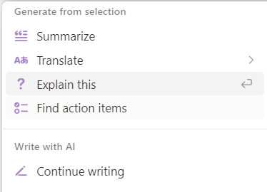

# Assignment-2

## Task-1
### 1. **Question 1.1:** 
_Provide screenshots and explanations to illustrate how well each guideline is followed in the MS HAI [guilelines](https://www.microsoft.com/en-us/research/uploads/prod/2019/01/Guidelines-for-Human-AI-Interaction-camera-ready.pdf). If you cannot accurately evaluate some guideline(s), provide concrete reasons._

**G1: Make clear what the system can do.**

Notion AI provides suggestions about what the user can do every time it is invoked, as can be seen in Figure 1. While the user can type in a free prompt, Notion AI clearly informs the users about all possible functions it can carry out.

_Figure 1: Notion AI suggestions on hitting Space_

**G2: Make clear how well the system can do what it can do.**

Since Notion AI uses GPT-3.5 under the hood, it shares similar shortcomings with ChatGPT - the generated content may be inaccurate or misleading. This limitation is acknowledged in each response, as shown in Figure 2.

_Figure 2: Notion AI warns of limitations of generated responses_

**G3: Time services based on context..**

Notion AI is based on GPT-3.5, which like other language models, is not designed to provide real-time information or location-based guidance. It operates based on the input it receives and generates responses accordingly. Therefore, for time-sensitive tasks, Notion AI may not be the most suitable tool.

**G4: Show contextually relevant information.**

Notion AI tweaks its AI suggestions based on the context by anticipating what the user needs at each step in the interaction. Here are a few scenarios where Notion AI shows contextually relevant information, when the user hits the `Space` key to call Notion AI:
- Starting a new page: Notion AI prioritizes suggestions for drafting functions like brainstorming ideas or writing a story, essay, blog post and more (see Image 1)
- Adding a new block around existing content: Notion AI prioritizes generating more ideas or extracting relevant information from the content, like "Continue writing", "Summarize" and "Find action item".

_Figure 3: Notion AI suggestions with existing content_
- Selecting a block of text: Notion AI gives precedence to providing suggestions related to editing the selected content, including changing the tone of or improving the writing, or fixing spelling and grammar mistakes.

_Figure 4: Notion AI suggestions on selecting text_

Source: [The design thinking behind Notion AI](https://www.notion.so/help/guides/using-notion-ai)

**G5: Match relevant social norms**

For the main functions provided by Notion AI, social norms do not particularly come into play. The AI functions are directly performed on the text, without much extra dialogue between the AI and user. However, the user has a certain amount of control over the nature of the generated content, for example, by defining the tone of the content. 

**G6: Mitigate social biases**

One of the current limitations of Notion AI is the possibility of bias in the outputted responses, a limitation inherent to the GPT-3.5 model. While measures are put in place to reduce biases, especially during model training, the model may still exhibit biased behavior or reinforce certain stereotypes. 

**G7: Support efficient invocation**

Notion AI can be invoked simply by hitting the `Space` key, which will open the prompt as seen in Figure 1. Similarly whenever a block of text is selected, the first option that appears is "Ask AI", highlighted in a different color.

_Figure 5: Pop up displayed on selecting text_

**G8: Support efficient dismissal**

Notion AI allows the user to easily dismiss the answer if the user is not satisfied through the "Discard" option present in the output for all generates responses (Figure 6).

_Figure 6: Notion AI output and further suggestions after changing tone of the selected text to "Professional"_

**G9: Support efficient correction**

Depending on the kind of operation, Notion AI offers features to edit the generated content or to redo the operation. For example, in Figure 6, Notion AI provides the option to make the generates response longer or to try again. It is also possible to type in a new prompt in plain language ("Tell AI what to do next...") to refine or edit the response as one desires. For example, one could prompt Notion AI to convert the output to a bulleted list or table format.

**G10: Scope services when in doubt**

Since Notion AI follows predefined instructions, it does not engage in disambiguation or gracefully degrade its services when uncertain about a user's goals

**G11: Make clear why the system did what it did**

Notion AI is an assistant that follows predefined instructions to provide responses based on user inputs. It does not have the ability to explain why it generated a specific output or provide transparency into its decision-making process. Its responses are based solely on the instructions it has been programmed with.

**G12: Remember recent interactions**

Searches are saved only if the user accepts the suggestions given by the AI and can be used for reference later. However, it does not save the prompts in a ‘history’ list format. It does not have the ability to retain information from previous interactions or remember specific user inputs. Each interaction with Notion AI is treated as an isolated event, and it does not have the capability to recall past information or context.

**G13: Learn from user behavior**

Notion AI does not learn from user behavior. It follows predefined instructions and does not have the ability to adapt or improve based on user interactions.

**G14: Update and adapt cautiously**

Notion AI does not limit disruptive changes when updating and adapting the AI system's behaviors.

**G15: Encourage granular feedback**

Yes, user can provide granular feedback and also give a thumbs up/down rating to the text prompts.

_Figure 6: Feedback suggestion_

**G16: Convey the consequences of user actions**

No. Notion AI does not really have any features/settings that will affect future interactions with the system. All operations are limited to the scope of the block 

**G17: Provide global controls**

No. Notion AI is limited to the block-level with all settings applied to a block. It is not possible to configure any global preferences or settings that will be applied to all operations. 

**G18: Notify users about changes**

Doesn’t explicitly notify people but new releases can be tracked through their blog posts or Twitter accounts.

### 2. **Question 1.2:** 
_Peform the same task with Q1.1 using the PAIR's [design patterns](https://pair.withgoogle.com/guidebook/patterns)._

We went through the 23 design principles created by Google. Having summarized them, we checked how they are being adhered to by Notion AI. Following are our findings:

1.	**AI adds value:** Notion AI augments the capabilities of the user. It helps to speed up the workflow and helps in enhancing the creativity of the user. It can generate text responses based on user’s questions and the current page context. There is a distinct positive addition which it brings to the user’s work. 

2. **Set the right expectations:** Notion AI is transparent about its capabilities and limitations. The company has cleary defined what the product [can do](https://www.notion.so/help/guides/using-notion-ai#:~:text=about%20artificial%20intelligence.-,What%20are%20the%20current%20functions%20of%20Notion%20AI%3F,-Use%20Notion%20AI) and what it [cannot do?](https://www.notion.so/help/guides/using-notion-ai#:~:text=product/ai.-,What%20are%20the%20current%20limitations%20of%20Notion%20AI%3F,-All%20AI%20outputs)

3. **Explain the benefit, not the technology:** Notion AI focuses on how it can help users be more efficient and creative, rather than explaining the underlying AI technology. Though they did provide a basic introduction to how they use AI to delivery the enhanced capabilities but that description is minimal in their docs. It is more about the [enhancements](https://www.notion.so/help/guides/notion-ai-for-docs) which the capability leads to instead of the technical background needed to create the same.

4. **Be accountable for errors:** Users have the final say on what to include in their docs. If they are not happy with what is generated by Notion AI, they can modify the text as they deem fit. Users also have access to the existing notion docs for [reference](https://www.notion.so/help/reference). We found that a lot of information regarding how the user can best utilise notion AI is present in the docs. 

5. **Invest early in good data practices:** Notion AI strives to maintain good data quality and protection standards. As documented in their [privacy reference](https://www.notion.so/help/privacy) and [security practices](https://www.notion.so/security), notion AI has considered data security, privacy compliance programs (GDPR, SOC 2 Type 2, ISO 27001, HIPAA) and AI governance principles. They maintain an enterprise-grade infrastructure to ensure high reliability.

6. **Make precision and recall tradeoffs carefully:** Notion AI mainly generates translations and summaries. We determined that it priortizes recall over precision because the output is not generated keeping a conservative estimate in mind ensuring only true positives. As translations, summaries can be subjective by nature: Notion AI ends up generating more than just the essential results which is expected since brainstorming is much more effective in an unrestricted ideation environment. However, for summarization related tasks, it can be much more conservative. Users can modify the prompt to get the results they want.

7. **Be transparent about privacy and data settings:** Notion AI is quite upfront about their privacy and data handling practices. They have defined the following in an easily accessible manner:
- [List of subprocessors](https://www.notion.so/Notion-s-List-of-Subprocessors-268fa5bcfa0f46b6bc29436b21676734)
- [Privacy practices](https://www.notion.so/help/privacy): Who owns the the data? Who handles it? Who controls it? Data backup and deletion practices
- [Security practices](https://www.notion.so/help/security-and-privacy): Data and application security profile, Access Control, Infrastructure, Endpoint Security, Network Security
- They support the following [product security features](https://www.notion.so/help/security-and-privacy#product-security-features):
  - Domain Management
  - SAML Single Sign-On (SSO)
  - SCIM Provisioning and Revoking
  - Audit Log
  - 2FA (MFA)
  - Permission and Team spaces management

8. **Make it safe to explore:** There is no kill switches in the notion AI through which user may unintentionally cause irreversible damage. Users have the capability to revert their actions and until user accepts the suggestion given by Notion AI, it is not applied to their document which makes it very user-friendly in terms of exploration from a user's perspective.

9.  **Anchor on familiarity:** Notion has maintained the existing UI they had for note-taking before introduction of Notion AI in the system. This means that AI features are packaged as a add-on to the main product which is notion rather than shifting the limelight from note taking to generative AI in the app which would have detracted users from the initial goal and familiarity of the notion system.

10. **Add context from human sources:** Notion AI uses user’s questions and the current page context to generate text responses. Users have full control on how the generated output is used. Since the interface for notion AI is designed in a manner similar to chatGPT, thus it will be simple for users to tailor the responses to their requirements by giving the right prompt to the system.

11. **Determine how to show model confidence, if at all:** Notion AI does not explicitly mention how it shows model confidence. We did not find evidence of different UIs being tried out in Notion AI before they arrived at the current one. Maybe, they will have such iterations in the future but we did observe that they are adding new capabilites to the system even in the span of 3 months. There is a new feature incoming which can serve as a QnA system for the notes created within the workspace. It will be quite useful for organisation level workspaces. [(source)](https://www.notion.so/blog/introducing-q-and-a)

12. **Explain for understanding, not completeness:** Notion AI provides the users with the information based on the prompt they have given and the text they have selected for generating the response. The context for the response can include both: i) the data within Notion, ii) the data from external sources using which chatGPT3.5 was trained. We did not find evidence of:
- model confidence displays
- partial explanations
- We did observe that if the user provides more prompts, the responses can get more detailed. Also, the user has the ability to set the length of the response which he/she is expecting based on the prompt.

13.  **Go beyond in-the-moment explanations:** Since Notion AI has the ability to access external information apart from the data contained in Notion, it is capable of and does provide explanation of concepts mentioned in the prompt and the selected text even though the context for them may not be present in the Notion database.

14. **Automate more when risk is low:** When the user is in brainstorming mode, then the outputs being generated are more varied and can have tangential viewpoints than what was mentioned in the prompts but when the user is trying to summarize the documents, the outputs are much more restricted.

15. **Let users give feedback:** Users can give feedback to the system. They can text with Notion AI using the chat-like interface or they can upvote/ dislike the response they received for their prompt.

16. **Let users supervise automation:** Users can select if they want to include the generated content in their notes or not. They can also select differnet types of tasks for which the response is to be generated. It influences the writing style but the users do not have any option to control the response while it is being generated.

17. **Automate in phases:** Though, Notion AI does not explicitly mention how it automates in phases but it does provide users the choice to adjust how they want to generate content. Users can choose the length of the content being generated depending on the task they are generating it for. There are options available to users to progressively increase the offloading of tasks to Notion AI.

18. **Give control back to the user when automation fails:** Notion AI does not take the control from the user because the final say on whether to include the generated content in the notes rests with the users itself. If the user is not satisfied with what they get as response, they can not include it in their write-up.

19. **Design for your data labelers:** Notion AI does not explicitly mention how it designs for data labelers. They mention that they maintain a list of [subprocessors](https://www.notion.so/Notion-s-List-of-Subprocessors-268fa5bcfa0f46b6bc29436b21676734) but each subprocessor may have a different retention policy to help them meet the customer obligations. We did not find which subprocessor is responsible for data labelling but we found that Anthropic OpenAI, Qwak are responsible for hosting large language models and embeddings.

20. **Actively maintain your dataset:** Notion AI does not explicitly mention how it maintains its dataset. When a specific query is executed for the selected block of user data, then it ingests the data for generating results. Though, officially they mention that data backed up in notes will not be used for training models for Notion AI but since it is a closed source product and there is no direct access to the backend AI API which notion uses, so we cannot comment how they maintain the dataset.

21. **Learn from label disagreements:** Since the underlying implementation supporting AI backend is abtracted, we cannot comment on how Notion AI learns from label disagreements.

22. **Embrace “noisy” data:** Notion AI does not explicitly mention how it embraces noisy data but we do think that the product is quite robust to different kinds of user inputs. Since the underlying implementation supporting AI backend is abtracted, we cannot comment on how noisy data has been embraced by notion AI.

23. **Get input from domain experts as you build your dataset:** Notion AI does not explicitly mention how it gets input from domain experts. They do use the chatGPT 3.5 version API to serve responses but they do not go into explicit details for the same. So, we cannot comment on how exactly the dataset was built and if inputs from domain experts was used.

### 3. **Question 1.3:** 
_Compare the report from the two works. Discuss how well they support the HAI design evaluation, including both their usefulness and limitations._

We observed that the Microsoft guidelines touch more on the user experience of the human-AI interaction, for example, G7 (Support efcient invocation), G12 (Remember recent interactions), and on the topic of AI ethics and principles, for example, G5 (Match relevant social norms) and G6 (Mitigate social biases).

On the other hand, the PAIR design patterns cover a broader spectrum of concerns, focusing on the architectural and developer-oriented considerations for human-AI design. For example, PAIR incorporates guidelines related to privacy and data settings, which is not covered by the Microsoft guidelines. It also covers topics like automation (automate more when risk is low, automate in phases) and inputs from domain experts. PAIR also promotes design considerations related to discrepancy handling, like label disagreements and noisy data. PAIR also tends to be more specific, providing examples and specific suggestions. 

#### Usefulness
Both Microsoft guidelines and PAIR design patterns offer valuable considerations when designing and evaluating AI products. The following are some useful aspects common to both works: 
- **Transparency**: Both works promote transparency in design, encouraging the design to plainly acknowledge limitations and potential inaccuracies. (G2: Make clear how well the system can do what it can
do and DP2: Set the right expectations). In our case, it helps users of Notion AI to understand that they should not hold the generated content as the final authority, which can be important when the stakes of having accurate information is high.
- **Incorporate user feedback**: Both works encourage allowing users to provide feedback about their interaction with the AI system, which is essential to for the continuous improvement of the product.
- **Giving users control over poor or incorrect predictions**: Both works highlight what to do when the AI product fails to deliver as expected or as the user desires. Having an easy and effective way to dismiss undesired outputs is an essential part of a good user experience. For example, if Notion AI replaced the user's content with its generated content without approval, it would not benefit the user in case of a poor prediction.

##### Microsoft guidelines
The Microsoft guidelines are useful to assess the ease of use of the AI system. It focuses on the user experience of the AI interaction, emphasizing the importance of clearly conveying the capabilities and limitations of the system, and ensuring that users can easily access the AI services and efficiently make decisions about the AI system's output. Another important aspect it touches upon is notifying users about changes in the AI system, which is especially useful in a rapidly evolving field. 

##### PAIR design patterns
The PAIR design patterns are useful to evaluate whether best practices are followed in implementation and to encourage develop to think about various architectural considerations while implementing the AI system. As AI systems deal with large amounts of data, privacy of the data is an important issue, which PAIR touches upon. PAIR also provides useful guidance on data labeling and dataset management. In addition, PAIR encourages gradual automation to adapt to the user's preferences.

#### Limitations

##### General limitations
We found that the Microsoft guidelines and the Google design patterns do not account for all the cases in which AI can be used in different systems. Since, we are still exploring different usecases in which AI can be incorporated in our existing system, there is a lot of scope to establish new usage patterns. Now, what this means for the guidelines and design patterns is that they need to predict the potential problems which may arise in so far unseen usecases and account for them. This is not a trivial task because most of the AI enabled applications are targetted to large scale user base (social media, etc) with a goal of providing personalised experience to all the users. This leaves a lot of room for fairness and privacy issues. 

These guidelines are limited in their coverage of fairness problems in AI systems. Google design patterns adopt more of a developer perspective and do not go into details of system bias and impartiality of the results while Microsoft guidelines do not explore the responsible usage of AI in a greater detail. They have bunched together all the ethical and impartiality issues due to the introduction of AI enabled systems under (matching of social norms) Guideline 5 and (mitigating social biases) Guideline 6. In the current state of AI/ML, there still exist non-deterministic aspects in our models where we cannot map each individual input to each output distinctly. There is a lot of work to be done in explaining why a particular AI system believes in a particular output. What these guidelines have done so far is to provide some structure in developing applications with the introduction of this non-deterministic abstraction in our otherwise deterministic software engineering practices but what is still missing from these guidelines is the careful evaluation and monitoring of AI enabled systems on people as a whole and society in general beyond the scope of just what the system is intending to cover in its domain.

In addition, the guidelines/design patterns may not cover every possible scenario or application domain, and specific industries or use cases might require additional, domain-specific considerations. AI systems in areas like healthcare, finance, or criminal justice may have unique challenges and ethical considerations that aren't explicitly addressed in the general PAIR guidelines.

We now discuss some specific limitations we identified for each work. Microsoft and PAIR each contain certain guidelines/design patterns that the other does not. We identify some of these missing guidelines/design patterns as limitations for the particular work, and justify why we view the absence as a limitation. 

##### Microsoft guidelines
In comparison with the PAIR design patterns, we observe that the Microsoft guidelines do not cover certain design considerations.
- **Limited details**: Overall, the Microsoft guidelines are limited with regard to the details they provide, presenting the guideline in one or two sentences. The research paper containing the guidelines focuses on the process of validating the guidelines through a user study. However, a detailed explanation for each guideline is not provided, although each guideline is supported by examples from the user study. In comparison, the PAIR guidelines offer a more comprehensive description, including specific steps or suggestions, image illustrations, and links to related reading and case studies. The lack of details can make it slightly harder for developers to implement the guidelines.
- **Conveying the privacy settings of the AI product**: Privacy settings and data quality are critical considerations in HAI, especially as users become increasingly concerned about how AI systems handle their personal information. While Microsoft guidelines may touch upon user control (G17) and clear communication (G1), they do not provide specific guidance on privacy-related considerations.

##### PAIR design patterns
- **Consideration of social biases**: It is interesting that the PAIR patterns cover a wide range of issues but do not discuss handling biases in the AI system's behavior, as this is a common and important issue in AI systems. Mitigating social biases is essential to ensuring a fair and inclusive AI system that everyone can benefit from. 
- **Notification of changes**: The PAIR patterns do not advise about notifying users of changes to the AI system. This is very important in an agile world, where new models and services are deployed continuously, adding new features and modifying current ones. Users need to be informed of these changes to effectively use the AI system.

_Explain how the design patterns help realize those design guidelines. Discuss if there is any aspect you find missing from either the guideline or design pattern to reveal the quality of the HAI design of the product._

#### Missing from the guidelines or design pattern for quality evaluation of the HAI design of the product
The biggest missing factor in both the guidelines and the design patterns is the lack of measurable metrics/ a method to make sure that the AI system is aligning well with them. In their current form, it is up to the willingness of system designers and developers, that how far are they willing to go and how much efforts are they willing to put in for understanding the implications of their AI enabled systems, not just across the domain in which their product is going to work in, but also in related areas where there can be spillover effects. With the added pressure of real world deadlines and costs involved in development, the designers/ developers may not want to digress from their technical work in order to make their system more aligned with the guidelines/ patterns. The problem is that there is no real way of distinguishing how well aligned a system is to the guidelines/ patterns or if adopting a different design strategy positively/ negatively affects the alignment of the product with the guidelines/ strategies. Currently, it is upto the discretion of the designers and developers which is quite open-ended and abstract.

To explain further, consider PEP 8 standards for python coding. These stylistic conventions were made to introduce a certain level clarity and standardisation in the code people write. There are various extensions available in different editors which can highlight the specific PEP warnings. It is also an integral part of code quality checks by providing metrics and warnings. Often these quality checking packages assign a score to the code file. Developers can relate the changes they make to the warnings they see and can eventually observe the changes in the score along with it.

So a similar system of measurement is needed for AI enabled systems as well to ensure greater accountability by system designers and adherence to the guidelines/ patterns established. We need to develop wrappers based on these guidelines considering the evolving usecases for AI and relate them to universally standardised metrics so that people can compare on a common ground and remove the abstraction based on individual's discretion.

## Task-2
### 1. **Question 2.1:** 
_Revisit the user stories you wrote in Assignment 1. Discuss what kind of decisions (big or small) its users need to make during interaction when trying to achieve their goals. Explain what the decision is, what knowledge is required to make the decision, and how much effort is needed to make such decisions._

For each user story we wrote in Assignment 1, we determined the decisions that the user had to make during the interaction with the AI, in order to achieve their goals:

1) **User story:** As a student, I want to have indications when I did spelling or c mistakes in a text so that I can be sure that I submit a report without grammatical or spelling errors. 
	- **Decision:** Accept or correct the spelling or grammatical suggestions.
		- **Knowledge:** Understanding of correct spelling and grammar.
	  - **Effort:** Low effort: the student only have to review and accept or reject the suggestions.

2) **User story:** As a student, I want to generate todo list from notes so that I can clearly know what I need to do next and keep track of my progress without wasting the time to transform my notes into a todo list by myself.
	- **Decision:** Determining which notes to give to the AI to generate the todo list.
	  - **Knowledge:** Familiarity with the notes and prioritization.
	  - **Effort:** Moderate effort: the student must actively think about which note to include.
    - **Decision:** Review the generate todo list and determine which ones are relevant to his/her needs.
      - **Knowledge:** Knowing his/her need and what can be relevent to him/her, knowing the notes.
      - **Effort:** Low effort: the student only have to review and keep or remove the todos.

3) **User story:** As a student, I want to generate content on events that are happening now or on recent works so that I can have up-to-date information when I study recent works or events. 
    - **Decision:** Creating the prompt to ask for information on a particular event.
      - **Knowledge:** Understanding of how to write a prompt.
      - **Effort:** Moderate effort: the student have to actively think about how to write the prompt.

4) **User story:** As a student, I want to generate key ideas from notes I wrote so that I can save time when I just want to remember the principal ideas of my lecture notes. 
    - **Decision:** Determining which notes to give to the AI to generate the key ideas.
      - **Knowledge:** Familiarity with the notes.
      - **Effort:** Low effort: most of the time, the student will just give the entire messy notes without reviewing them a lot.
   
5) **User story:** As a team collaborator, I want to quickly summarize and structure messy meeting notes into a clear meeting minute so that I can save time and send to my collaborators clear and structured meeting minutes. 
    - **Decision:** Determining which meeting notes to give to the AI to generate the meeting minute.
      - **Knowledge:** Understanding of meeting context and familiarity with the notes.
      - **Effort:** Low to moderate effort: the effort will depend on how efficient the AI is, and whether the notes can be given almost entirely to generate an understandable and relevant meeting minute.
    - **Decision:** Choose the information that should appear in the meeting minute / the structure of the meeting minute (in the case where the user gives more information to the AI to generate the meeting minute)
      - **Knowledge:** Understanding of meeting context and familiarity with the notes.
      - **Effort:** Moderate effort: the collaborator have to actively think about the structure of the meeting minute.
   
6) **User story:** As a team collaborator, I want to generate a meeting agenda based on notes or old meeting minutes so that we can know exactly what we should discuss in meetings. 
    - **Decision:** Determining which old meeting minutes to give to the AI to generate the meeting agenda.
	    - **Knowledge:** Familiarity with the old meeting minutes.
	    - **Effort:** Moderate effort: the collaborator must actively think about which mitunes are relevant to generate the meeting agenda.
    - **Decision:** Review the generate meeting agenda and determine which parts are relevant to the meeting.
      - **Knowledge:** Understanding of meeting context.
      - **Effort:** Moderate effort: maybe the collaborator have to correct some of the generate part of the meeting agenda.
   
7) **User story:** As a team collaborator, I want the AI to automatically add into my calendar the next meetings or deadlines that we discussed in our meeting notes so that I'm sure I won't miss any appointments or deadlines. 
    - **Decision:** Removing irrelevant dates adding to the calendar by the AI.
      - **Knowledge:** Awareness of upcoming events and deadlines.
      - **Effort:** Low effort: The collaborator only have to review the new deadlines add to his/her calendar after the meeting.
   
8) **User story:** As a researcher I want to generate a summary for a research paper so that I can easily know what the paper is about and what are the key ideas of the paper. 
    - **Decision:** Determine the length of the summary and/or how detailed the summary is.
      - **Knowledge:** Understanding of the amount of information needed to capture important key ideas of a paper.
      - **Effort:** Low effort: This is a decision that may require a little effort for the first papers, but over time the researcher will know his or her preferences.
    - **Decision:** Determine if he or she would like more information on a part of the paper after reading the first summary. (for example regenerate a summary for a particular part, or asking for more precision)
      - **Knowledge:** Understanding of the paper's subject.
      - **Effort:** High effort: The researcher have to understand he summary and know what can be relevant for his/her research.
   
9) **User story:** As a researcher I want to know how Notion uses my data when I use their AI so that I can know if I can use AI to work on sensitive content that requires privacy. 
    - **Decision:** Assessing the privacy implications of using the Notion AI knowing the Notion's Privacy Policy.
      - **Knowledge:** Understanding Notion's privacy policy.
      - **Effort:** High effort: The research have to understand perfectly the privacy information.
   
10) **User story:** As a researcher and a non-native English speaker, I want to easily translate what I write so that I can get help writing my papers in English when I don't know the translation of a word. 
    - **Decision:** Choosing when to use language translation.
      - **Knowledge:** Identifying words where he or she don't know the translation.
      - **Effort:** Low effort: Most of the time, it's easy to know when you don't know the translation by yourself.
    - **Decision:** Choosing to accept the translation or not.
      - **Knowledge:** Understanding of the language
      - **Effort** Low effort: The researcher only have to review the translation.

11) **User story:** As a researcher and a non-native English speaker, I want the AI to reformulate and improve what I wrote so that my papers seem to be written by a native English speaker. 
    - **Decision:** Selecting sentences for improvement.
      - **Knowledge:** Understanding of English language.
      - **Effort:** Moderate effort: The researcher have to review and accept the improvements.

12) **User story:** As a researcher I want to quickly structure all the references I keep track of so that I can quickly find a reference that I am looking for. 
    - **Decision:** Adding a reference.
      - **Knowledge:** Knowing the reference relevance. 
      - **Effort:** Low effort: for a researcher, this is done rather automatically.
    - **Decision:** Choosing the category of the references.
      - **Knowledge:** Understanding of the research domain.
      - **Effort:** Moderate effort: The researcher have to actively think about which category are relevant.

13) **User story:** As a researcher who work in a lab with not much fundings, I want to have access to some Notion AI features for free so that I can be more productive in my research and participate in the common good without spending money. 
    - **Decision:** Choosing which features are essential for free use. (for example in the case where notion leaves the possibility of choosing a limited number of features for free)
      - **Knowledge:** Understanding Notion's AI feature.
      - **Effort:** Moderate effort: The researcher have to actively think about which features are relevant for his/her works.

14) **User story:** As an academic member, I want to generate a list of ideas on a specific subject so that I can quickly collect ideas that I can develop for a project or a work.
    - **Decision:** Creating the prompt to generate the list of ideas.
      - **Knowledge:** Understanding of how to write a prompt.
      - **Effort:** Moderate effort: the academic member have to actively think about how to write the prompt.

### 2. **Question 2.2:** 
_Examine each decision-making point closely and consider if the users are vulnerable to any of the four biases from the work [Judgment under uncertainty: Heuristics and biases](https://www.jstor.org/stable/pdf/1738360.pdf?casa_token=PEUwAsY9bNoAAAAA:i7KvVWYA73fJzugepP9xnVfBc_tCv1TWq884garHfyiwpR0kooepIGbSSfu__bxvaMYyMxTwGpCTCfzWrRXJI5-ghi44wtwX_WrGiSdQ2fKla6PhPH8), i.e., Representativeness, Availability, Adjustment and Anchoring. Explain how the design of the product exacerbates or alleviates each of the users' biases._

1a. Decision: Accept or correct the spelling or grammatical suggestions.
  - **Availability**: There will likely be no doubt with regard to spelling mistakes as Notion AI can accurately correct spelling mistakes. However, for grammatical corrections, the user could be subject to availability bias if they want to judge the accuracy of the correction. They may need to rely on their memory of grammatical rules to evaluate the corrections. 
  - **How the design exacerbates the bias**: Notion AI does not highlight the changes made, but simply outputs the corrected text. This may make it slightly harder to identify the corrected text and check its accuracy. 

2a. Decision: Determining which notes to give to the AI to generate the todo list
  - **Availability**: This decision again could be influenced by availability bias. Users may be more likely to select notes that contain information readily available to them, neglecting less accessible notes. This could cause the to-do list to miss out some important tasks that were note covered by the notes.
  - **How the design alleviates the bias**: Notion AI allows you to select particular text blocks to perform an AI operation on. This allows the user to select only what they wish to give. Notion also provides templates to organize meeting notes systematically which can facilitate the user's task of choosing relevant notes. 

2b. Decision: Review the generated todo list and determine which ones are relevant to his/her needs.
  - **Availability**: To determine which tasks are relevant to his/her needs, the user needs to make this judgement based on what they recall best from the meeting discussion or their notes.  
  - **How the design alleviates the bias**: As described in the previous notes, Notion helps to organize one's notes which can help the user verify the generated content more easily by quickly referring to these notes.

3a. Decision: Creating the prompt to ask for information on a particular event.
  - **Representativeness**: The way the prompt is framed may be influenced by the user's preconceived notions about the event which may in turn skew the generated content.
  - **How the design alleviates the bias**: Notion AI does not reinforce any preconceived notions the user may have as it does not autocomplete a user's prompt, allowing them to represent their thought fully.

4a. Decision: Determining which notes to give to the AI to generate the key ideas.
-  **Availability**: Same reasoning as 2a.

5a. Decision: Determining which meeting notes to give to the AI to generate the meeting minute.
  - **Availability**: It is more likely that the user will provide the AI with the parts of the meeting notes that he has understood the best, possibly the parts he has written. If other meeting members have added notes that the user has not really taken the time to understand, it is less likely that he will give them to the AI to create the meeting minutes. This is an availability bias.
  - **How the design alleviate the bias**: Given that in the collaborative mode of Notion, everyone can write and read all created files, other team members can review the generated meeting minutes and check if any parts are missing. Notion also provides templates to organize meeting notes systematically which can facilitate the user's task of choosing relevant notes.

5b. Decision: Choose the information that should appear in the meeting minute / the structure of the meeting minute (in the case where the user gives more information to the AI to generate the meeting minute)
  - **Availability**: It is more likely that the user will generate meeting minutes similar to what he is accustomed to using in his meetings, even if it is less relevant for these particular meeting minutes.
  - **Anchor**: The first template that is presented to the user is more likely to be chosen.
  - **How the design alleviate the biases**: Notion provides templates to organize meeting notes systematically which can facilitate the user's task of choosing relevant notes.

6a. Decision: Determining which old meeting minutes to give to the AI to generate the meeting agenda.
  - **Availability**: It is more likely that the user will provide the meeting minutes that he is familiar with.
  - **How the design alleviate the biases**: The readability of meeting minutes created by Notion's AI allows the user to quickly understand the older meeting minutes with which he is not familiar.

6b. Decision: Review the generate meeting agenda and determine which parts are relevant to the meeting.
  - **Representativeness**: It is possible that the user makes this decision based on what he believes is a good meeting agenda, relying on his own understanding of the representation of a meeting agenda.
  - **How the design alleviate the biases**: The agenda ideas generated by Notion's AI can give the user new ideas for filling in the meeting agenda. The separation into blocks allows the user to easily delete or keep only small parts.

7a. Decision: Removing irrelevant dates adding to the calendar by the AI.
  - **Representativeness**: The user often has a preconceived idea of what a relevant date may be and will apply their own representation of this idea when selecting dates.
  - **How the design alleviate the biases**: The dates generated by Notion's AI can give the user new ideas for planning his/her life.

8a. Decision: Determine the length of the summary and/or how detailed the summary is.
  - **Adjustment and anchoring**: It's likely that the user will initially use the default settings and never change them because he/she will be used to this length of summary and this amount of details.
  - **How the design exacerbates the bias**: Notion gives default settings.

8b. Decision: Determine if he or she would like more information on a part of the paper after reading the first summary. (for example regenerate a summary for a particular part, or asking for more precision)
  - **Availability**: It's likely that if the user is more familiar with a concept in the paper, it's more probable that this concept will catch their attention, and they would want more details on it than if the concept is new to them and they only have a brief overview. If the summary of the new concept doesn't explain why it's important/useful or doesn't clarify the concept well, the user may not seek further information.
  - **How the design exacerbates the bias**: Notion's AI uses GPT-3.5, which can sometimes explain a concept poorly when summarizing it.

9a. Decision: Assessing the privacy implications of using the Notion AI knowing the Notion's Privacy Policy.
  - **Anchoring**: The user will probably read Notion's privacy policy only once, and even if it changes, they may not necessarily alter their perception of Notion's privacy policy.
  - **How the design alleviate the biases**: Notion notifies users when they change their privacy policy.

10a. Decision: Choosing when to use language translation.
  - **Representativeness**: It's likely that the user has a preconceived idea of what should be translated or not (e.g., proper nouns), so the user will use translation only when they believe it aligns with their idea of what should be translated.
  - **How the design alleviate the biases**: Notion mainly allows for the translation of entire texts rather than word-for-word, which reduces this bias as there are fewer choices to make, thus less freedom in the selection.

10b. Decision: Choosing to accept the translation or not.
  - **Availability**: If the user does not understand the proposed translation, it's likely that they will be less inclined to choose it compared to a situation where they understand the suggested translation.
  - **How the design exacerbates the bias**: Notion allows to regenerate a translation for a given text if the first translation does not suit us.

11a. Decision: Selecting sentences for improvement.
  - **Availability**: Same explanation as 1a.

12a. Decision: Adding a reference.
- **Availability**: There is no particular bias here, but the output depends on the references available to the researcher at the time.
- **How the design could affect the bias**: The design does not really influence the bias, as the user would add the reference from an external source.

12b. Decision: Choosing the category of the references.
- **Adjustment and anchoring**: Notion AI may automatically categorize the references and the user will have to adjust inaccurate categorizations or add new ones. This decision can be influenced by the initial category Notion AI assigned.
- **How the design exacerbates the bias**: They very action of automatically categorizing the references by Notion AI opens the door to this bias.

13a. Decision: Choosing which features are essential for free use. (for example in the case where notion leaves the possibility of choosing a limited number of features for free)
- **Availability**: This decision does not directly involve any response generated by Notion AI, but simply to a user's hypothetical decision while subscribing to the product. For the sake of discussion, this decision could be subject to availability bias as the user would need to select the desired features based on what he/she thinks to be important at the moment.
- **How the design could alleviate the bias**: By providing a set of default recommended or most common features can help the user decide which features to use, but could also introduct adjustment bias. 

14a. Decision: Creating the prompt to generate the list of ideas.
- **Representativeness**: The way the user frames the prompt can be influenced by their stereotypes about the particular subject which can skew Notion AI's response.
- **How the design alleviates the bias**: Notion AI does not reinforce any preconceived notions the user may have as it does not autocomplete a user's prompt, allowing them to represent their thought fully.

_For the designs that alleviate users' biases, what kind of information should be presented and how so that it might improve the users' decision-making?_
- If we consider all the decisions described above which alleviate bias and try to determine a common thread in them, we will find that almost all such decisions fall in the following catergories of actions to be performed by user: **Reviewing, determining the suitability of something, creating the prompt, choosing something, giving the final confirmation, assessing the trade between two options**

- This means that most of the work from user's part is offloaded to AI and the user is responsible in making the final decision to choose whether to accept the created work or not. Now whatever information can help users in the actions mentioned above is the information which will improve the decision-making process in our app.

- **What can be such information?**
  The user should be able to view the complete picture of both sides of the decision he/she is about to make. The UI should display to the user what the intermediate output of choosing a particular type of option would be and it should be reversible. This will allow the user to make up his/her own mind after seeing the output for each perspective. It is possible that intelligent systems may permeate biases based on the output being generated for the user but even if the output may not be completely impartial (afterall the system is as impartial as the training data and models used) which may not be practical in all circumstances, atleast having outputs from each perspective can be quite helpful for the user because the user will know what to expect and not to completely rely on the system. Alot of the AI enabled products use some sort of AI API in the backend to power their services. The API providers should clearly mention what their models/ AI services can and cannot do. There should be a clear description with examples of the scenarios when the models may not work as expected and that the app/ system developers need to come up with their own logic for the same.

- **How should the information be presented?**
  For Notion AI, such a information can be presented in the form of displaying intermediate outputs by splitting the screen in two parts while giving the option to the user to pick one. It would be wrong to influence the user in the name of eliminating bias by pushing a particular view more than the other. The right approach should be to present both perspectives to the user and it should be the user who makes the decision. Because the content of a User's notion workspace is considered to be written by User and a representative of his/her viewpoints. Lastly, as an enhancement, there can be a adjustable toggle for deciding the parameters of the model to generate the response. Currently, the app has different menu options to select the type of response expected to be generated by Notion AI but it can be further customised by toggling individual styles and emotions in the response. The GUI can look quite similar to how it looks in games where such graphics are used to customize character parameters.

  - A sample UX screen from chatGPT: depicting two choices for user
  (source: google images: uxwhisper)
  

### 3. **Question 2.3:** 
_Revisit the persona you created in Assignment 1. Discuss the consequences for the users (including how they would feel and act) if they adopt the product and make decisions. Then, stretch your imagination and discuss how it might impact the relationship between the persona and other stakeholders as the system becomes more integrated into their daily routine. [5]_

**Maya:**

**Consequences for Maya:**

Maya might feel a sense of relief as routine tasks are streamlined, but she may also experience stress if the AI's output doesn't meet her standards or stifles her creativity.
she would lean on the AI for efficiency but may also carry out specific times to do work manually to ensure she maintains her critical thinking skills.

**Impact on Relationships:**

As Maya becomes more dependent on Notion AI, she could influence her peers to adopt similar tools, potentially changing the study groups from traditional discussions to more technology-driven ways.
Professors might question the depth of her understanding if her work appears lack of her voice, prompting Maya to balance AI use with her own inputs.

**Carl:**

**Consequences for Carl:**

Carl would appreciate the increased productivity within his team but might feel anxious about the team's over dependent on AI and potential loss of originality.
he would be proactive in ensuring that Notion AI is used as a supplement to the team’s work rather than a replacement, maintaining the creative process.

**Impact on Relationships:**

Team Dynamics could shift because members vary in their dependencies  on AI, with Carl taking a leadership role in guiding the responsible use of AI.

**Akira:**

**Consequences for Akira:**

Akira may feel a combination of relief at the ease of managing administrative tasks and concern over privacy and originality.
he would likely become more insecure about data security and careful to ensure that AI-generated content doesn’t compromise the integrity of his research.

**Impact on Relationships:**

With His Research Team, Akira's approach to AI could lead to a team environment where there's a strong focus on attention to detail and using technology in a responsible and ethical way.
In the Academic Community, he could influence the conversation around AI, driving forward discussions on privacy, data security, and the role of AI in research.

### **Task3**: 
Presentation

## Contribution

**Question 1.1**: Varun [G1-G9] ([commit 1](https://gitlab.cs.mcgill.ca/comp585_2023f/team-4/-/commit/ce93bd4d54875882d611f7a64436e019bec7009f)) + Rishabh [G10-G18] ([commit1](https://gitlab.cs.mcgill.ca/comp585_2023f/team-4/-/commit/17cf913341f08568ee35c9063ec6e567a93cd227), [commit2](https://gitlab.cs.mcgill.ca/comp585_2023f/team-4/-/commit/00812e54a53701b36bee0f896282d1ced83330b3))

**Question 1.2**: Aayush ([commit 1](https://gitlab.cs.mcgill.ca/comp585_2023f/team-4/-/commit/30188ff30b7e1aba37c40991537005d9f9c78acc))

**Question 1.3**: Rishabh [usefulness] ([commit1](https://gitlab.cs.mcgill.ca/comp585_2023f/team-4/-/commit/960cf1e91868e0dd96b8339e319701b094333610), [commit2](https://gitlab.cs.mcgill.ca/comp585_2023f/team-4/-/commit/5d7f9eaaa281290f5430de870d10d128b3f04ab6)) + Varun [limitations] ([commit1](https://gitlab.cs.mcgill.ca/comp585_2023f/team-4/-/commit/c1c63aa50ddc7769a70d59400724f16f7d9f7615)) + Aayush [limitations + missing aspects] ([commit 1](https://gitlab.cs.mcgill.ca/comp585_2023f/team-4/-/commit/4f2c9d522284b293e16677904ea3e3eefe96ce2e))

**Question 2.1**: Tamara ([commit 1](https://gitlab.cs.mcgill.ca/comp585_2023f/team-4/-/commit/a7efd32e1af7994cfe0a529c319bb03bdd55b379), [commit 2](https://gitlab.cs.mcgill.ca/comp585_2023f/team-4/-/commit/6ed3ae3257cfcb4919ecfe1a6716a8d9b9155d67), [commit 3](https://gitlab.cs.mcgill.ca/comp585_2023f/team-4/-/commit/e6c19a49b045c8f069e1bdade318e3c21b55b8c7), [commit 4](https://gitlab.cs.mcgill.ca/comp585_2023f/team-4/-/commit/111a59c035a30cca1cb587970a5786fed19c4b63), [commit 5](https://gitlab.cs.mcgill.ca/comp585_2023f/team-4/-/commit/e9995df6b4c0f356668d5183a382c5d91aad7e3d), [commit 6](https://gitlab.cs.mcgill.ca/comp585_2023f/team-4/-/commit/60decb9e98599576fb51720fb8cac9d55e41296b))

**Question 2.2**: Tamara [user stories 5-10] ([commit 1](https://gitlab.cs.mcgill.ca/comp585_2023f/team-4/-/commit/52a53313eaf8d28b5143ed6216680c030145e5a1), [commit 2](https://gitlab.cs.mcgill.ca/comp585_2023f/team-4/-/commit/07a69c73fc7f8a2382e2a95259bb41482ca09682), [commit 3](https://gitlab.cs.mcgill.ca/comp585_2023f/team-4/-/commit/e768c36c3c16e5f3bb0635b4b4b5f041e178df15)) + Varun [1-4] ([commit1](https://gitlab.cs.mcgill.ca/comp585_2023f/team-4/-/commit/cebb27a16ef7b60aac48950129874bfbffa7a98b)), [11-14] ([commit1](https://gitlab.cs.mcgill.ca/comp585_2023f/team-4/-/commit/c4e2ea3e2a2e9cc4d97ecbf3d843b3530d385006)) + Aayush 
([commit 1: 2.2.2](https://gitlab.cs.mcgill.ca/comp585_2023f/team-4/-/commit/30188ff30b7e1aba37c40991537005d9f9c78acc),
[commit 2: 2.2.2](https://gitlab.cs.mcgill.ca/comp585_2023f/team-4/-/commit/051c2f045be2fcc95b8ac272c26eb78441c1396d)) 

**Question 2.3**: Yaoqiang ([commit 1](https://gitlab.cs.mcgill.ca/comp585_2023f/team-4/-/commit/14fe2916c172d98bf34e8a7cd7e79ab8ea400469), [commit 2](https://gitlab.cs.mcgill.ca/comp585_2023f/team-4/-/commit/f95cbace033ef27a28e6178ef2397d5b8e032d4f))

Repo cleanup, admin, issue creation: Aayush ([commit](https://gitlab.cs.mcgill.ca/comp585_2023f/team-4/-/commit/86a18b92e4f3f7adba1f4b3da4b8e6ced936ea6e))

Please find meeting notes: [here](https://gitlab.cs.mcgill.ca/comp585_2023f/team-4/-/wikis/Assignment-2-meeting-notes) - They contain progress updates, ideas discussed, the ToDos, and how the work was divided.
